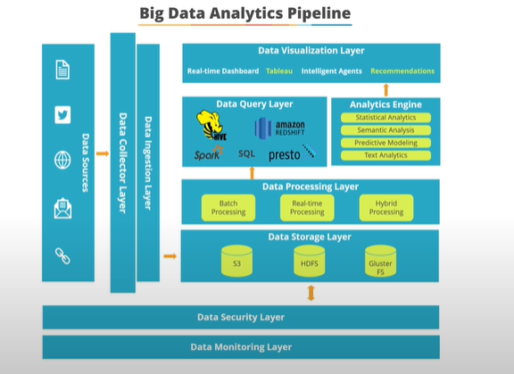
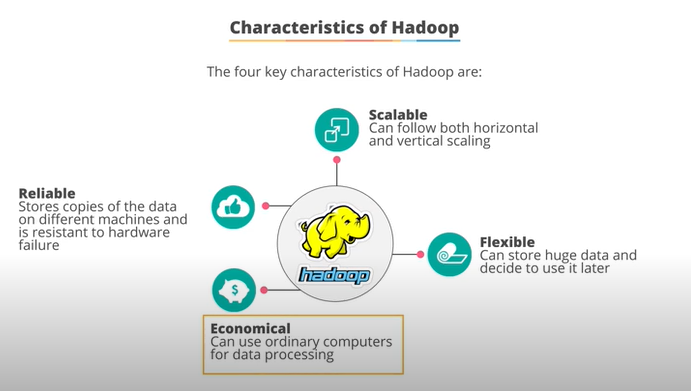
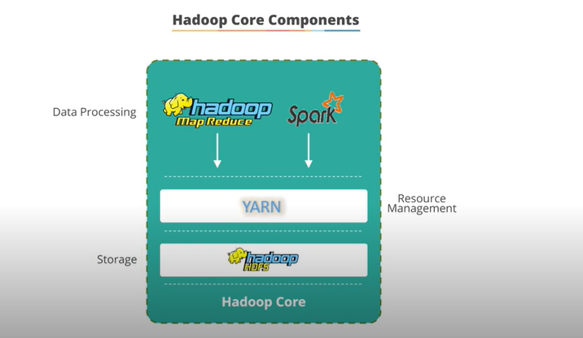

# Big Data Hadoop and Spark Developer

Tradicionalmente nos basabamos en la intuición para la toma de decisiones, a día de hoy el Big Data nos permite tomar una visión comprensiva de nuestros datos sin importar que tan grande sea la organización.

### Big Data Analytics Pipeline

### Data types

## 4 Vs del Big Data

• **Volumen:** Grandes cantidades datos

• **Variety:** Social, CRM, emails, audio, etc

• **Velocity:** Velocidad con la que los nuevos datos son generados

• **Veracity:** Datos incorrectos producen predicciones incorrectas

### Traditional RDBMS and DWH

### Advantages of big data
1. Procesar todos los tipos de datos a gran escala
2. Procesar grandes cantidades de datos en tiempo real
3. Puede correr en cualquier lugar, el hardware puede ser añadido sin inconvenientes
4. Mejor toma de decisiones gracias a integrar la información

El Big Data está basado en sistemas distribuidos (ordenadores conectados sobre una red), estos tienen inconveniente que actualmente son sokventados con Hadoop para poder distribuir la carga y el procesamiento.

## Hadoop

